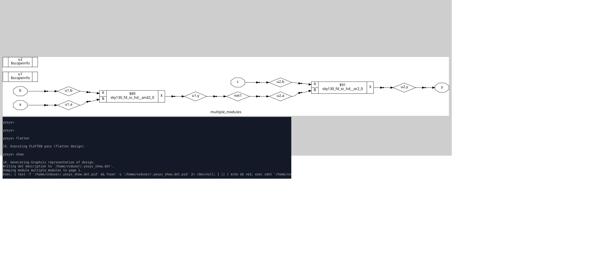
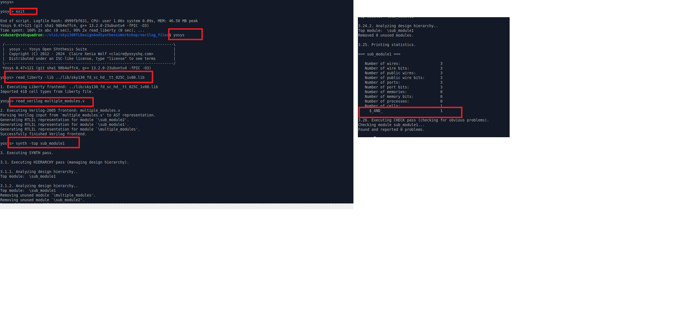
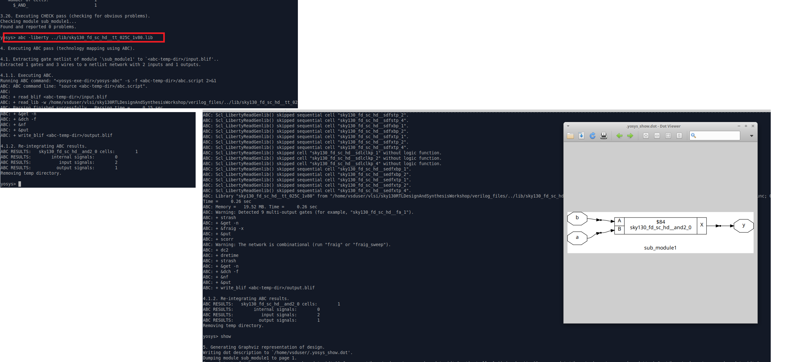

**.lib**
.lib contains the slow fast and medium speed cells
Open Sky130 library

130--> 130nm library
tt--> typical
025c--> temprature
PVT: Process Voltag Temprature; these are important for design to work
Process variation are due to fabrication i.e. variations due to fab machines. Variations are also in voltage and temprature. These PVT defines how the Silicon works
eg, a product used in different conditions so need it to work in all conditions.
You can see operating conditions, voltage, process, time units, resistance unit used in the same file

.lib is a bucket of all std cells as shown below, CELL marks the begining of cell defination
eg cell is and 2 or gate a2lll0_1

we can open its behavioral model
withoutr PP we will open , PP->> Power port 
!A --> A is off
D1--> D is on
Power associated with this is mentioned 

**Hierarchical vs Flat synthesis**
Open multiple_modules.v file located in verilog files directore

Now, first launch yosys and read the lib file 

read verilog file multiple module.v

synthesise, you can see the deails as below
After this use abc -liberty and SHow, it will show hierarchial design

Now will see how netlist looks like 
can use no attr switch, hierarchies will be preserved

**Stacked Nmos is better thhan Stacked PMOPS

Now will see *FLATTEN*

Flatten and show, you wil not see U1 and U2 unlike before

**Submodule level Synthesis**

it infered only gate.
now will link the design using abc - liberty

and then show 
So only submodule 1. we did controlled the module which we was synthesising becoz say if we have a same module instantiated multiple times, so instead synthesisng the same module say 4 times, we synthesise he modules once and replicate the netlist maany times in top level
So Modulelevel systhesis is prefered when have multiple instances of same module
Also second reasom is if say design in massive and if design is given to the tool, it will not werk properly so will prefer giving portion by portion to get good optimized netlist, stiched at the top level.
synth -top <module name >is used in yosys to control which module to sysnthesise

**FLOPS AND FLOP CODING STYLE**
All files reqired are in verilog files directory
Flop: Combi ckts have propogation delay so glitches are exopected, 

So we need element to store a value called flop. Flops are storage elements
If put flop between Comb clks, even though input is unstable, output will be stable and glitch will not be propogating throughout and output of combi ckt will be stable
There is a initial stage of flop. To initialize we have reset and set which can be asyn or sync

*Flop with asynch Reset*
Thsi is a posedge flop, whenever the clock and rest changes, if reset happens, If is have high priority then else. If any changes in CLK or reset, always block is executed
Under async reset, q will go low upon this asyn_rest. Else, only at posedge, q is getting d. If negedge, always block will not be executed. Its async rest as it does  not wait for any clock 

Synchronous, will turn to D pin of the flop

**flop with both sync and asyn set reset**

**Lets now simulate the flops**

It shows that when reset commes, immediately the q comes down
Now will see for async set
Set is 1, q is 1 irespective of d unless set is 1. Its async set behaviours

Now will see sync reset
Reset is  priority here

**Now lets synthesise these ckts and see what happens**
Will now go to YOSYS. lets synthesise async reset flop
1. Read liberty files
2. Read design by read_verilog
3. Set synth -top
4. as using flop, need to use dfflibmap -liberty as in flow, seprate flop library is there in std cell library, so need to mention this for tool to aware of where to pick this from here no such thing, we have same library so will point to same library

5. So we wrote flop with active high reset but flop have active low rst so tool inserted invertor.

Similarly can synthesise other codes
Now will see flop with sync reset

Here, no set pin no reset pin, it only have sync reset
We can see A_N i.e. inverted input.

**OPTIMIZATION**
Lest look at rtl code
All required files are in verilog file folder
Will see mult2.v and mult8.v files
 
So accepting 3 bit input, 4 bit output y and y=2*a
 a    y
000 0000
001 0010
010 0100
011 0110
100 1000
101 1010
110 1100
111 1110
only last bit is getting appended
so a[0], no HW required to do so
if say x4 is there then its append 2 0s ie 5x4 = 20, 0101 * 4 = 10100
X8 appends 3 0s
In code we have y=a*2
lets see what it is synthesise to 

No cells infered,

No need to call abc as no cell to infer 

Show

i.e. a appended with 1'b0. I.e we expected 

