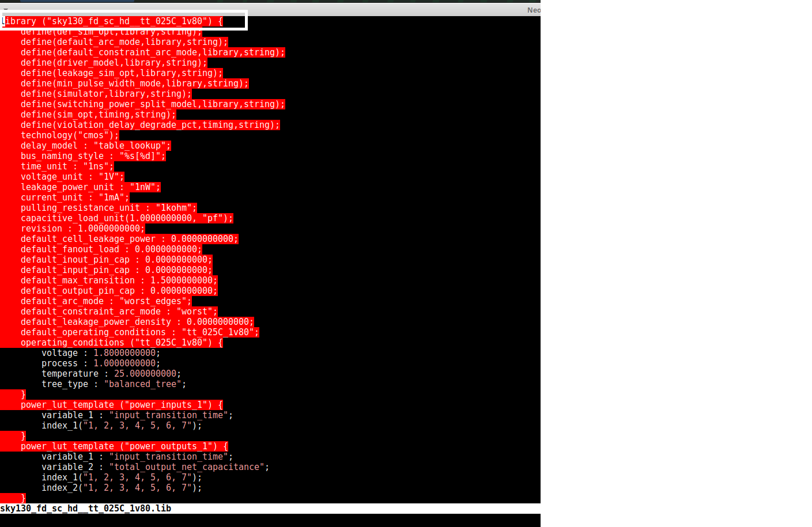
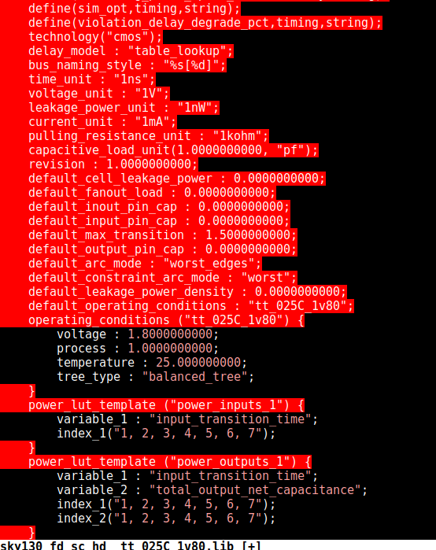
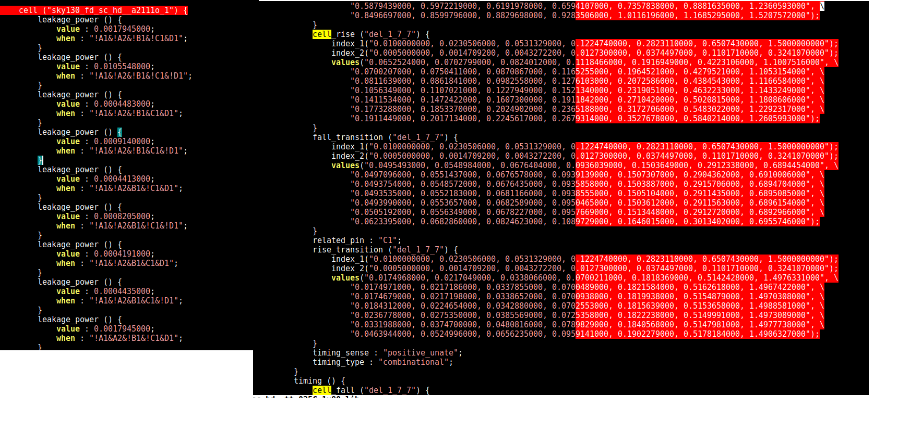
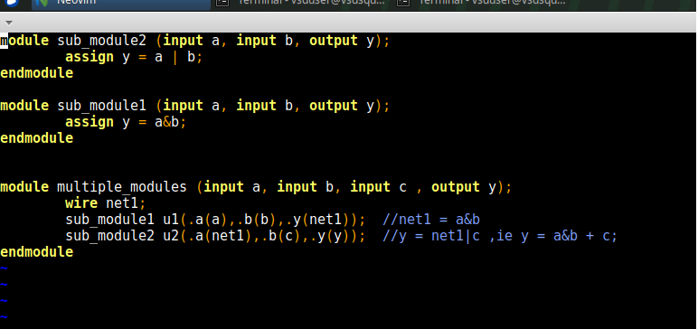
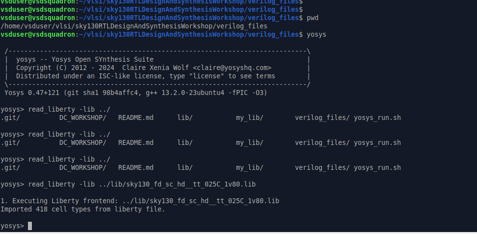
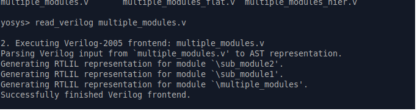
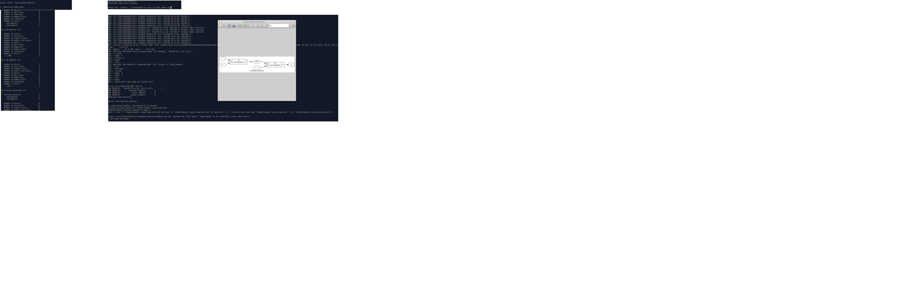
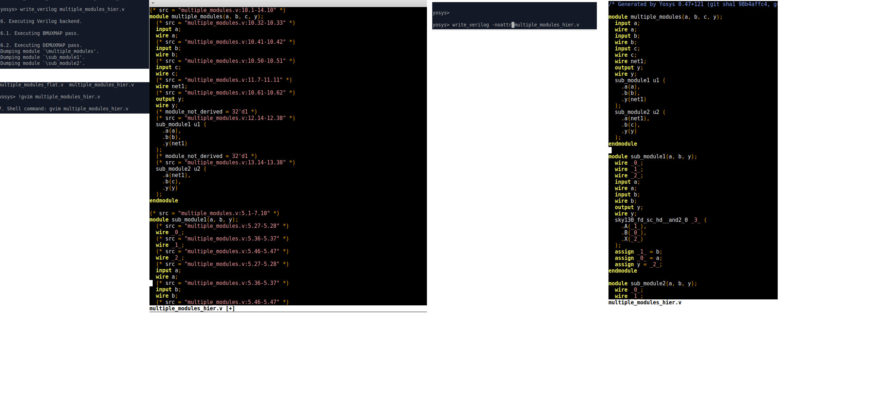
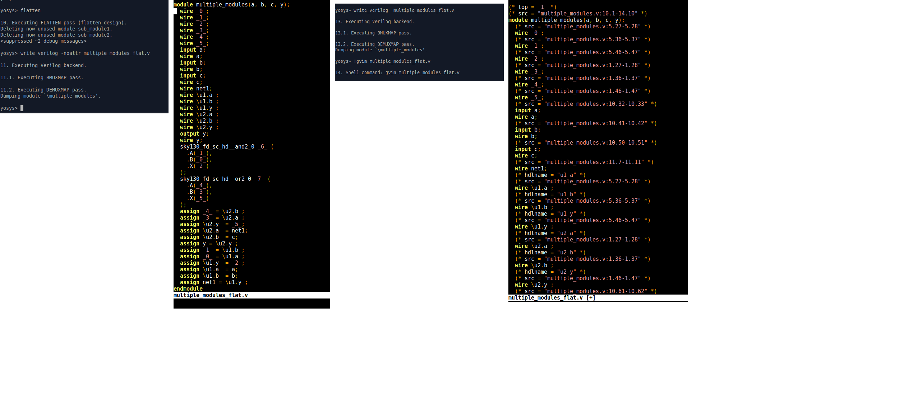

**.lib**
.lib contains the slow fast and medium speed cells
Open Sky130 library

130--> 130nm library
tt--> typical
025c--> temprature
PVT: Process Voltag Temprature; these are important for design to work
Process variation are due to fabrication i.e. variations due to fab machines. Variations are also in voltage and temprature. These PVT defines how the Silicon works
eg, a product used in different conditions so need it to work in all conditions.
You can see operating conditions, voltage, process, time units, resistance unit used in the same file

.lib is a bucket of all std cells as shown below, CELL marks the begining of cell defination
eg cell is and 2 or gate a2lll0_1

we can open its behavioral model
withoutr PP we will open , PP->> Power port 
!A --> A is off
D1--> D is on
Power associated with this is mentioned 

**Hierarchical vs Flat synthesis**
Open multiple_modules.v file located in verilog files directore

Now, first launch yosys and read the lib file 

read verilog file multiple module.v

synthesise, you can see the deails as below
After this use abc -liberty and SHow, it will show hierarchial design

Now will see how netlist looks like 
can use no attr switch, hierarchies will be preserved

**Stacked Nmos is better thhan Stacked PMOPS

Now wil see *FLATTEN*

