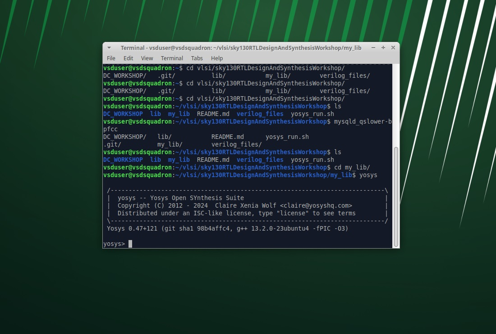

**Introduction:** 
Simulator : Tool used to check a design. RTL is implentation of spec and adherence to spec is checked using the tool Iwave (SIMULATOR)
Testbench: To ensure design adhere to specified specification, need to apply stimulus to design to check functionality For ever change in input, output is evaluated. If no change inm input, no evaluation happens
eg: AND gate, 2 inputs one output. for boh 2 inputs need to applly input and check the output. We need both stimulus generator and observer.
Iverilog simulation flow:
Design >> write TB >>>iVerilog >>> output be VCD file (VALUE CHANGE DUMP) -> USe GTK wave tool to see waveform 
Now will see how to work with iverilog and GTWAVE
Load design in i verilog
Use command iverilog <File_name.v> <TB_for_File_name.v>

Use gtkwave to see the waveform 

**YOSIS and LOGIC SYNTHESIS**
Synthesizer is used o convert the RTL to netlist --> yosys is used here
Design>>.lib-->YOSYS-> Netlist (rep of standard cells)
Commands:
read_liberty--> read the .lib file
read_verilog--> read the design
write_verilog--> execution gives the netlist and shol be rep of the design in form of cells present in the .lib
? How to verify that systesize is done correctly??
To verify synthesis output, 
Netlist + Testbench --> iverilog --> VCD file -> GTKWAVE and waveform output, stimulus should be same as the output obseved during RTL simulation.
Netlist is the true form of design 
Testbench will be same as a RTL testbench. We dont need new testbench

**LOGIC SYNTHESIS:**
RTL design is the behavioral rep of required specification. 
RTL to gate level transition is called synthesis
Design is converted to gates and gates are connected. THis is given as a file called netlist

RTL+Front ENd Lib --> SYnthesis --> NETLIST
.lib: Its a collection of logic modules i.e different varients of gate (slow medium fast, as combinatonal delay in logic path determine the max speed of operation)
FAST CELLS--> setup 
tclk>Tcq_a+Tcombi+tsetup_b
tclk, clock period 
Tcq_a, clock propogation delay of A flop
Tcombi, is combinational circuit propogatrion delay
tsetup_b, is a time before the clock edge, need to supply data to B flop
so, Fclk (max)=1/Tclk(min)
High Fclk, need cells to work very fast.

Faster cells come ih penaly of area and power. The load in digital ckt is in form of capacitance, faster charging/dischagring i.e. small capacitance, lesser the delay. It needs the transistor capable of sourcing more current i.e. wide transistors 
Wide transistor -> Low delay --> More area and Power

SLOW CELLS--> hold
Thold(b)< Tcq_a+Tcombi
Thold(b)< Tcq_a+Tcombi
What A flop launch in first cycle, should be captured by B at next cycle, so delay from a to b should be greater then hold time, 
To make sure no hold issues at capture flop (b) , need slow cells

Slower cells. The load in digital ckt is in form of capacitance, slower charging/dischagring i.e. large capacitance, more the delay. i.e. narrow transistors.
Narrow transistor0-> Hign delay --> Less area and Power

So need to guide the sysnthsizer to select the flavour of cells
To guide synthesizer, we use Constraints

**Synthesizer:**
1. Do Syntax check
2. MAp design (Module to top level design)
RTL converted in the form of Standard cells and givenm in the form of netlist
**LAB3: Intro to YOSYS**
Invoke Yosys 

Read the library now 

